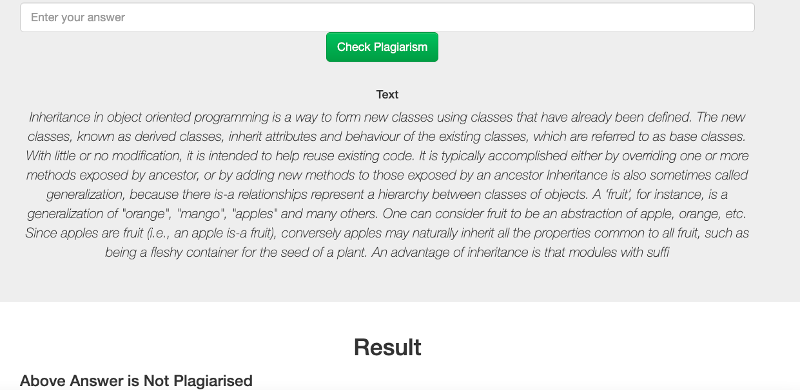
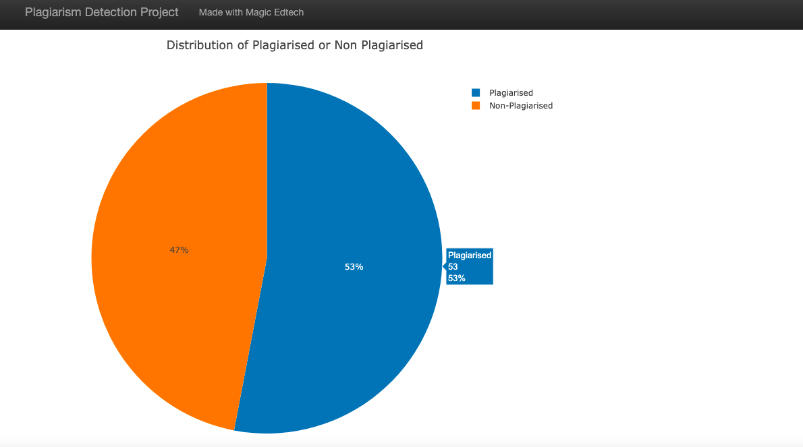

# Magic Learning Analytic Project

## Description

This Project is a part of Magic Learning Analytic.
We have kept one base answer and checking incoming answer is plagiarised on not.

The Project is divided in the following Sections:

1. Load Data
1. Text Processing
2. Feature Engineering step
3. Modeling
4. Evaluate
5. Deployment 

## Getting Started

### Dependencies
* Python 3.5+ (I used Python 3.7)
* Machine Learning Libraries: NumPy, Pandas, Sciki-Learn, 
* Web App and Data Visualization: Flask, Plotly
* Natural Language Process Libraries: NLTK

### Activate Virtual environment using python or pyenv
```
# Activate using python
python3 -m venv env
source env/bin/activate
```

```
# Activate using pyenv
pyenv activate venv
```

### Install requirement file
```
pip install requirements.txt
```

### Executing Program:
1. Run the following commands in the project's root directory to set up your model.

    - To run ML pipeline that trains classifier and saves
        `python models/train_classifier.py`

2. Run the following command in the app's directory to run your web app.
    `python app/run.py`

3. Go to http://0.0.0.0:3001/


<a name="screenshots"></a>
## Screenshots

1. This is an example of a message you can type to test Machine Learning model performance



3. The main page shows some graphs about training dataset, provided by Figure Eight

